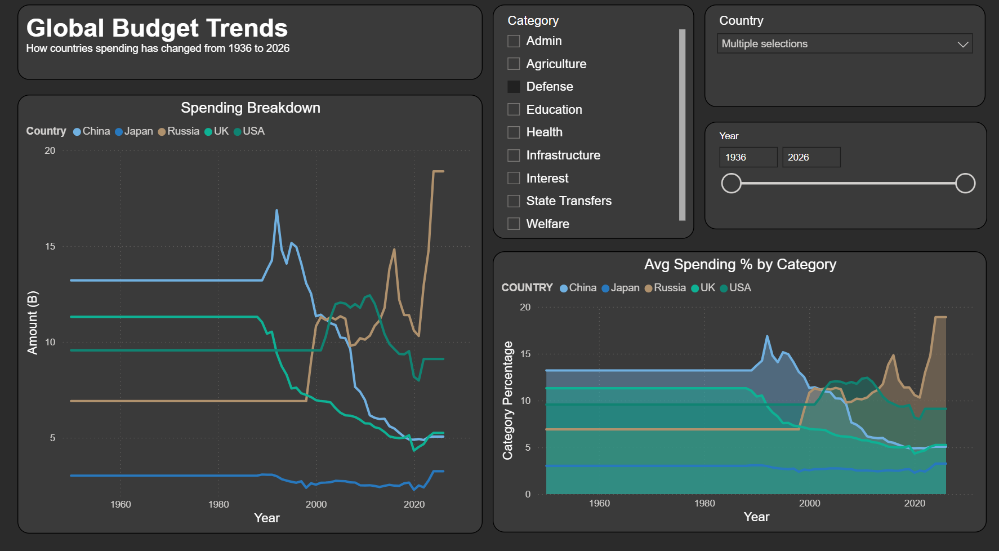
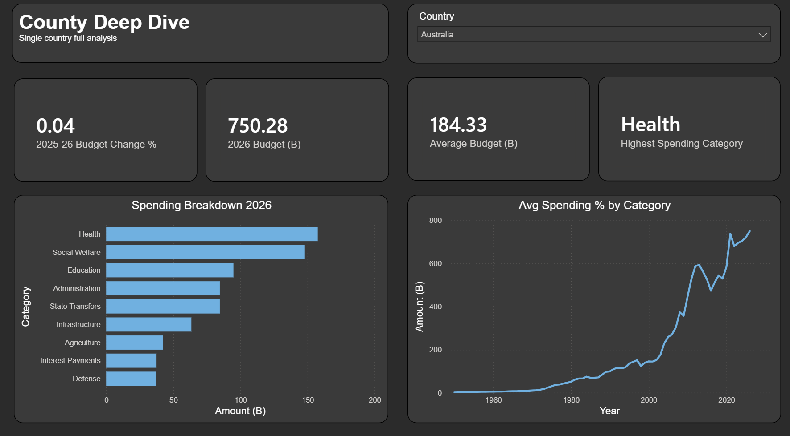
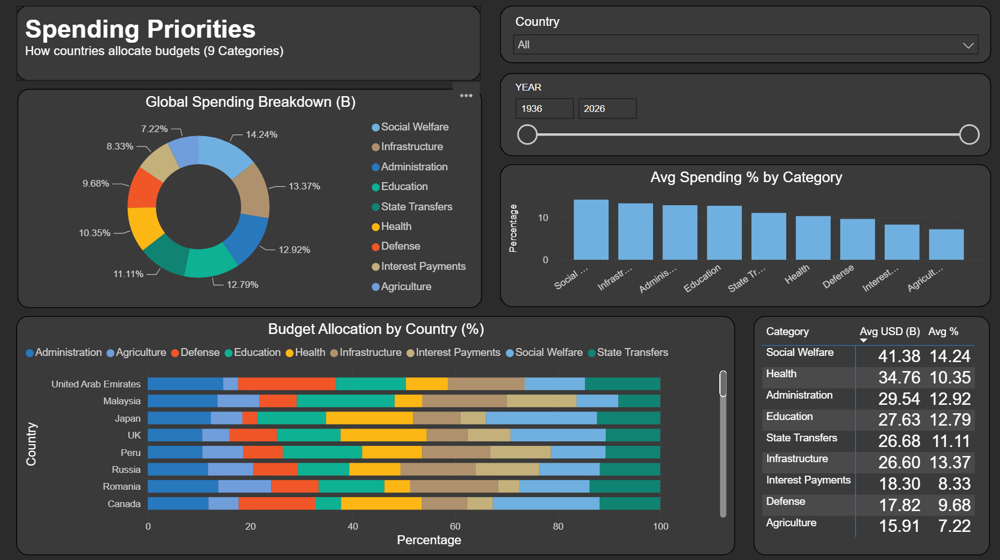

# Global Government Budget Analytics Pipeline

An end-to-end data engineering pipeline that analyzes 90 years of government
budget data across 45 countries using AWS S3, Snowflake, dbt Core, and Power BI.

---

## Overview

This project builds an end to end data stack pipeline that ingests historical
government budget data, transforms it through model layers, and delivers
interactive visualizations. The pipeline covers 45 countries from 1936 to 2026,
analyzing how governments allocate spending across defense, education, healthcare,
administration, state transfers infrastructure, social welfare, intrest payments
and agriculture. The dashboard enables multi country comparisons, trends over time,
and year-over-year budget ranking.

---

## Features

- 45 countries and 90 years of historical government budget data
- Multi-layer dbt transformation (staging → marts)
- 4 analytical mart models built for visualization
- Interactive Power BI dashboard with dynamic slicers
- Cross-country spending comparison and category breakdowns

---

## Tech Stack

- **AWS S3** — raw file storage
- **Snowflake** — cloud data warehouse
- **dbt Core** — data transformation and modeling
- **SQL** — transformation logic across all models
- **Power BI** — interactive dashboard and visualization

---

## Dashboard Screenshots

### Budget Trends

### Country Deep Dive

### Spending Priorities

